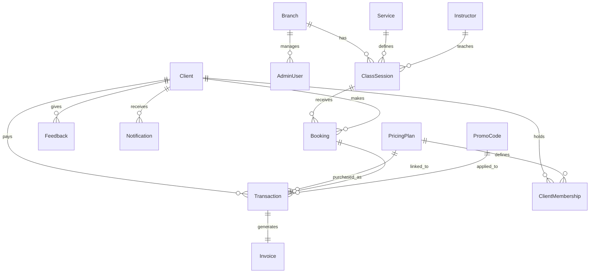

# PRD: TICPILATES

**Versi:** 1.0 (Draft — menunggu approval)
**Status:** Draft. Arah desain sudah ditetapkan berdasarkan `design-TICPILATES.md`; keputusan teknis dan operasional yang tersisa masih tercatat di Section 23.

---

# 1. Product Overview

- **Nama produk:** TICPILATES
- **Ringkasan:** Web app manajemen studio Pilates untuk booking kelas, jadwal, membership, promo, dan pembayaran, dengan self-service booking untuk klien.
- **Masalah utama yang diselesaikan:** Studio Pilates saat ini mengelola jadwal, membership, dan pembayaran secara manual (spreadsheet/WA/kertas), menyebabkan double-booking, sulit tracking member aktif, dan tidak ada data penjualan/retensi yang rapi.
- **Nilai utama produk:** Satu sistem terpusat untuk operasional studio — dari jadwal, membership, transaksi, sampai check-in — plus kanal self-service untuk klien booking sendiri.
- **Platform:** Web responsive (desktop + mobile browser), tidak ada native app di MVP.
- **Target pengguna:** Owner/Admin studio Pilates skala single-location di Indonesia.

# 2. Problem Statement

- **Siapa yang mengalami masalah:** Owner/admin studio Pilates single-location.
- **Masalah yang dialami:** Pengelolaan jadwal, kapasitas kelas, membership, dan pembayaran tersebar di banyak tools manual (Excel, WA, buku kas).
- **Penyebab masalah:** Tidak ada sistem terintegrasi yang menyatukan booking, membership, dan pembayaran dalam satu alur.
- **Dampak masalah:** Double-booking kelas, kesulitan tracking sisa sesi member, rekonsiliasi kas manual rawan salah, tidak ada data retensi/performa untuk pengambilan keputusan bisnis.
- **Mengapa perlu diselesaikan:** Studio butuh sistem yang scalable ke multi-cabang di masa depan tanpa migrasi ulang, sambil tetap ringan dipakai untuk operasional harian single-location saat ini.

# 3. Target Users & Personas

**Persona 1 — Owner/Admin Studio**
- Role: Pemilik atau admin operasional studio
- Tujuan: Mengelola jadwal, membership, transaksi, dan melihat performa bisnis dari satu dashboard
- Kebutuhan: Kontrol penuh atas kapasitas kelas, harga, promo, dan laporan keuangan
- Pain points: Rekonsiliasi manual, tidak tahu real-time sisa kuota kelas atau sisa sesi member
- Perilaku utama: Login harian, cek jadwal & kehadiran, input transaksi manual, review laporan mingguan/bulanan

**Persona 2 — Klien Studio (via Online Store)**
- Role: Pengguna akhir yang booking kelas dan membeli paket
- Tujuan: Booking kelas sesuai jadwal yang tersedia, beli paket/membership, bayar online
- Kebutuhan: Lihat jadwal real-time, proses booking & bayar cepat, konfirmasi instan
- Pain points: Tidak tahu kuota kelas tersisa, harus chat admin manual untuk booking
- Perilaku utama: Akses Online Store, pilih kelas/paket, bayar via payment gateway, terima konfirmasi

> **OPEN QUESTION (lihat Q1):** Persona 2 dipilih via module scope (Online Store), tapi di pertanyaan "siapa pengguna MVP" hanya Owner/Admin yang dipilih. PRD ini mengasumsikan klien mengakses Online Store sebagai **guest** (tanpa akun terdaftar) — lihat Section 5 & 13.

# 4. Goals & Non-Goals

## Goals
- Owner/Admin dapat mengelola seluruh siklus operasional studio (jadwal → booking → transaksi → laporan) dari satu sistem.
- Klien dapat booking kelas dan membeli paket secara mandiri via Online Store dengan pembayaran online.
- Arsitektur data mendukung multi-cabang di masa depan tanpa migrasi struktural (lihat Section 11 — model `Branch`).
- Check-in kehadiran klien dilakukan cepat via QR scan.

## Non-Goals
- Tidak ada native mobile app (iOS/Android) di MVP.
- Tidak ada multi-cabang aktif di MVP — hanya arsitektur yang siap (single branch record dibuat default).
- Tidak ada role Instruktur atau Front-desk Staff dengan akses login terpisah di MVP (lihat OPEN QUESTION Q2).
- Tidak ada aplikasi kasir/POS offline terpisah — transaksi manual tetap diinput lewat dashboard admin yang sama.

# 5. User Roles & Permissions

| Role | Hak Akses | Fitur | Data Dilihat | Data Dibuat | Data Diubah | Data Dihapus |
|---|---|---|---|---|---|---|
| **Owner/Admin** | Penuh, satu-satunya role login di MVP | Semua 13 modul | Semua data studio | Schedule, Services, Pricing Plans, Customers, Sales, Promo Codes, Marketing, Settings | Semua data di atas | Semua data di atas (dengan konfirmasi) |
| **Klien (guest)** | Tanpa login, akses terbatas ke Online Store | Lihat jadwal publik, booking kelas, beli paket, bayar online | Jadwal & harga publik, riwayat booking miliknya sendiri (via link/kode booking) | Booking baru, transaksi pembelian paket | Tidak bisa ubah data lain | Tidak bisa hapus data |

> **OPEN QUESTION (Q2):** Instruktur dan Front-desk Staff tidak dipilih sebagai role MVP, tapi modul Services menyebutkan "alokasi instruktur" dan Scan Customer biasanya dioperasikan front-desk. Rekomendasi: di MVP, instruktur hanya jadi **data referensi** (bukan akun login) yang dipilih Admin saat set jadwal; Scan Customer dioperasikan dari akun Admin yang sama (misal tablet di resepsionis login sebagai Admin). Role terpisah untuk Instruktur/Staff masuk **V2**.

# 6. User Stories

**Owner/Admin**
- Sebagai Admin, saya ingin membuat jadwal kelas baru dengan kapasitas dan instruktur tertentu, supaya klien bisa booking sesuai slot yang tersedia.
- Sebagai Admin, saya ingin mengatur jenis layanan (group/private class) beserta durasi dan kapasitas, supaya katalog kelas konsisten.
- Sebagai Admin, saya ingin membuat paket harga (single pass, bundle, membership bulanan), supaya klien punya pilihan pembayaran.
- Sebagai Admin, saya ingin melihat database klien beserta riwayat kehadiran dan paket aktif, supaya saya tahu status tiap member.
- Sebagai Admin, saya ingin mencatat transaksi penjualan manual (untuk pembayaran offline), supaya semua transaksi tetap tercatat di sistem.
- Sebagai Admin, saya ingin melihat laporan pendapatan dan tren kehadiran, supaya saya bisa evaluasi performa bisnis.
- Sebagai Admin, saya ingin membuat kode promo dengan batas penggunaan dan masa berlaku, supaya saya bisa jalankan campaign diskon.
- Sebagai Admin, saya ingin mengirim broadcast promosi atau reminder sesi ke klien, supaya retensi member meningkat.
- Sebagai Admin, saya ingin melakukan scan QR klien saat check-in, supaya kehadiran tercatat otomatis dan cepat.
- Sebagai Admin, saya ingin mengatur profil bisnis dan integrasi pembayaran di Settings, supaya sistem siap dipakai sesuai kebutuhan studio.

**Klien**
- Sebagai klien, saya ingin melihat jadwal kelas yang tersedia beserta sisa kuota, supaya saya bisa pilih sesi yang cocok.
- Sebagai klien, saya ingin booking kelas dan membayar online, supaya saya langsung dapat konfirmasi tanpa chat admin.
- Sebagai klien, saya ingin membeli paket membership secara mandiri, supaya saya bisa langganan tanpa datang ke studio dulu.
- Sebagai klien, saya ingin menerima kode QR setelah booking, supaya saya bisa check-in cepat saat tiba di studio.

# 7. User Flow

**Flow Admin (Setup Jadwal → Transaksi):**
Login → Dashboard → Services (buat jenis kelas) → Pricing Plans (buat paket) → Schedule (buat sesi kelas, pilih service + instruktur + kapasitas) → Kelas tayang di Online Store → Sales (jika ada transaksi manual, input langsung) → Reports (review performa)

**Flow Klien (Self-service Booking):**
Buka Online Store → Pilih kelas dari jadwal → Isi data (nama, no. HP/email) → Pilih metode bayar (paket atau single pass) → Bayar via payment gateway → Validasi pembayaran →
- **Jika sukses:** Booking terkonfirmasi, dapat kode QR/booking code → tampil halaman sukses + (opsional) email/WA konfirmasi
- **Jika gagal:** Tampil error, kembali ke pilihan metode bayar, slot tidak dikunci (lihat Section 15 — race condition)

**Flow Check-in:**
Klien tiba di studio → Admin scan QR klien → Sistem validasi kode booking terhadap sesi hari ini → Jika valid, status booking berubah jadi "Checked-in" → Jika tidak valid/kadaluarsa, tampil error dengan alasan

# 8. Feature Scope

## MVP

| Fitur | Tujuan | Prioritas | Role | Dependensi |
|---|---|---|---|---|
| Dashboard | Ringkasan jadwal hari ini & performa singkat | Wajib | Admin | Schedule, Sales |
| Schedule | Kelola jadwal sesi kelas & kalender | Wajib | Admin, Klien (lihat saja) | Services |
| Services | Katalog jenis layanan/kelas | Wajib | Admin | - |
| Pricing Plans | Paket harga & membership | Wajib | Admin | - |
| Customers | Database klien | Wajib | Admin | Booking, Sales |
| Sales | Transaksi & invoice | Wajib | Admin | Pricing Plans, Customers |
| Reports | Laporan keuangan & performa | Wajib | Admin | Sales, Schedule |
| Promo Codes | Kode diskon | Wajib | Admin | Pricing Plans |
| Online Store | Booking & pembelian mandiri klien | Wajib | Klien | Schedule, Services, Pricing Plans, Payment Gateway |
| Scan Customer | Check-in via QR | Wajib | Admin | Schedule, Sales |
| Settings | Profil studio, integrasi payment | Wajib | Admin | - |
| Marketing | Broadcast promosi/reminder | Wajib (per pilihan Ahmad) | Admin | Customers |
| Customer Centricity | Riwayat interaksi, feedback member | Wajib (per pilihan Ahmad) | Admin | Customers |

> **Catatan risiko scope:** Semua 13 modul dipilih sebagai MVP. Ini scope besar untuk versi pertama — lihat Section 20 untuk urutan implementasi bertahap supaya tetap bisa dites/deploy incremental, meski semuanya tetap dianggap "MVP" sesuai keputusan kamu.

## V2
- Role Instruktur & Front-desk Staff dengan akses login terpisah
- Native mobile app
- Multi-cabang aktif (UI switch antar cabang)
- Review/rating klien yang tampil publik

## Future
- Waitlist otomatis saat kelas penuh
- Loyalty points / referral program
- Integrasi kalender eksternal (Google Calendar sync untuk instruktur)

# 9. Functional Requirements

### Schedule (Jadwal Kelas)

**Purpose:** Mengelola sesi kelas yang bisa dibooking klien.
**Actor:** Admin (kelola), Klien (lihat & booking via Online Store)
**Precondition:** Minimal 1 Service dan 1 Instructor (data referensi) sudah dibuat.
**Input:** Tanggal, jam mulai/selesai, Service, Instructor, kapasitas maksimal.
**Process:** Sistem membuat record `ClassSession`, menghitung sisa kuota (`capacity - jumlah booking aktif`) secara real-time.
**Validation:** Jam mulai < jam selesai; tidak boleh overlap jadwal instruktur yang sama; kapasitas > 0.
**Business Rules:** Sesi yang sudah lewat waktu mulai tidak bisa dibooking lagi; sesi yang sudah ada booking tidak bisa dihapus, hanya bisa dibatalkan (status `cancelled`) dengan notifikasi ke klien yang sudah booking.
**Output:** Daftar sesi kelas di kalender Admin & Online Store.
**Success State:** Sesi tersimpan dan langsung tayang di Online Store.
**Failure State:** Validasi gagal → tampilkan pesan error spesifik (mis. "Instruktur sudah punya jadwal di jam ini").

**Acceptance Criteria:**
```
Given Admin membuka form buat jadwal baru
When Admin mengisi tanggal, jam, service, instruktur, dan kapasitas valid, lalu submit
Then sesi kelas baru tersimpan dan muncul di kalender Schedule serta Online Store

Given Admin memilih instruktur yang sudah punya sesi lain di jam bersamaan
When Admin submit form jadwal
Then sistem menolak dan menampilkan pesan error konflik jadwal
```

### Online Store — Booking & Pembayaran

**Purpose:** Klien bisa booking kelas dan bayar mandiri.
**Actor:** Klien (guest, tanpa login)
**Precondition:** Ada sesi kelas dengan kuota tersedia.
**Input:** Pilihan sesi kelas, nama, no. HP/email, metode pembayaran.
**Process:** Sistem membuat `Booking` berstatus `pending`, redirect ke payment gateway, menunggu callback status pembayaran.
**Validation:** Kuota sesi masih tersedia saat submit (re-check di server, bukan hanya di client); nomor HP/email format valid.
**Business Rules:** Slot booking di-*hold* sementara (mis. 10 menit) selama proses pembayaran berlangsung untuk mencegah overbooking; jika pembayaran tidak selesai dalam waktu tersebut, hold dilepas otomatis.
**Output:** Booking terkonfirmasi + kode QR unik.
**Success State:** Booking `confirmed`, kuota sesi berkurang 1, kode QR ditampilkan/dikirim.
**Failure State:** Pembayaran gagal → Booking tetap `pending`/`failed`, kuota tidak berkurang, klien bisa coba ulang.

**Acceptance Criteria:**
```
Given klien memilih sesi kelas dengan sisa kuota 1
When klien menyelesaikan pembayaran sebelum ada klien lain yang mengambil slot yang sama
Then booking klien tersebut berhasil dan kuota sesi menjadi 0

Given klien memilih sesi kelas dengan sisa kuota 0
When klien mencoba booking
Then sistem menolak dengan pesan "Kuota penuh" sebelum masuk ke halaman pembayaran
```

### Sales (Transaksi & Invoice)

**Purpose:** Mencatat seluruh transaksi, baik dari Online Store maupun input manual Admin.
**Actor:** Admin (input manual & lihat semua), sistem (otomatis dari Online Store)
**Precondition:** Ada Client dan Pricing Plan/Booking terkait.
**Input:** Client, item (paket/kelas), jumlah, metode pembayaran, status.
**Process:** Membuat record `Transaction` + `Invoice`, update status membership klien jika transaksi berupa pembelian paket.
**Validation:** Jumlah > 0; item wajib dipilih.
**Business Rules:** Transaksi dari Online Store otomatis berstatus sesuai callback payment gateway; transaksi manual defaultnya `paid` kecuali diset lain oleh Admin.
**Output:** Invoice tercatat, riwayat transaksi klien terupdate.
**Success State:** Transaksi tersimpan, invoice bisa dilihat/dicetak.
**Failure State:** Validasi gagal → form tidak tersimpan, pesan error ditampilkan.

**Acceptance Criteria:**
```
Given Admin membuat transaksi manual untuk klien yang membeli paket single pass
When Admin submit dengan data lengkap dan valid
Then transaksi tercatat berstatus "paid" dan riwayat pembelian klien terupdate
```

### Promo Codes

**Purpose:** Mengatur kode diskon yang bisa dipakai saat booking/pembelian.
**Actor:** Admin (kelola), Klien (pakai saat checkout)
**Precondition:** Minimal 1 Pricing Plan/Service ada untuk dikaitkan (atau berlaku umum).
**Input:** Kode, tipe diskon (persen/nominal), nilai, masa berlaku, batas penggunaan (total & per klien).
**Process:** Validasi kode saat checkout, hitung diskon, kurangi sisa kuota pemakaian.
**Validation:** Kode unik; masa berlaku belum lewat; kuota penggunaan belum habis.
**Business Rules:** Kode yang expired atau habis kuota otomatis ditolak saat checkout tanpa perlu Admin nonaktifkan manual.
**Output:** Diskon diterapkan ke transaksi.
**Success State:** Total pembayaran klien berkurang sesuai diskon.
**Failure State:** Kode tidak valid → pesan error spesifik ("Kode sudah kadaluarsa" / "Kode sudah mencapai batas penggunaan").

**Acceptance Criteria:**
```
Given klien memasukkan kode promo yang valid dan masih ada kuota
When klien menerapkan kode saat checkout
Then diskon diterapkan ke total transaksi dan kuota kode berkurang 1

Given klien memasukkan kode promo yang sudah kadaluarsa
When klien menerapkan kode
Then sistem menolak dan menampilkan pesan error
```

### Scan Customer (QR Check-in)

**Purpose:** Mempercepat proses check-in kehadiran klien di studio.
**Actor:** Admin
**Precondition:** Klien sudah punya booking `confirmed` dengan kode QR.
**Input:** Hasil scan kode QR (via kamera device).
**Process:** Sistem mencocokkan kode dengan booking hari ini, update status jadi `checked-in`.
**Validation:** Kode harus cocok dengan booking yang sesinya berlangsung hari ini; belum pernah check-in sebelumnya.
**Business Rules:** Check-in hanya bisa dilakukan pada hari sesi berlangsung (tidak bisa check-in untuk sesi besok/kemarin).
**Output:** Status kehadiran klien terupdate.
**Success State:** Tampil konfirmasi "Check-in berhasil" + nama klien & nama kelas.
**Failure State:** Kode tidak valid/sudah dipakai/salah hari → tampil pesan error spesifik.

**Acceptance Criteria:**
```
Given klien punya booking confirmed untuk sesi hari ini
When Admin scan kode QR klien tersebut
Then status booking berubah jadi "checked-in" dan tampil konfirmasi

Given kode QR sudah pernah di-scan sebelumnya
When Admin scan ulang kode yang sama
Then sistem menolak dengan pesan "Sudah check-in sebelumnya"
```

> Modul lain (Customers, Reports, Marketing, Customer Centricity, Settings) mengikuti pola CRUD + business rules standar di atas — detail lengkap per-field ada di Section 11 (Data Model). Beri tahu saya kalau kamu mau breakdown functional requirement penuh untuk modul-modul tersebut juga.

# 10. UI/UX Requirements

| Halaman | Tujuan | Role | Komponen Utama | Filter/Search | Empty State | Responsive |
|---|---|---|---|---|---|---|
| Dashboard | Ringkasan harian | Admin | Card ringkasan, mini-calendar, notifikasi | - | "Belum ada jadwal hari ini" | Sidebar gelap + canvas terang; responsive tablet/desktop |
| Schedule (Calendar) | Kelola & lihat jadwal | Admin | Kalender view (day/week), form buat/edit sesi | Filter by service, instructor, tanggal | "Belum ada kelas di tanggal ini" | Wajib mobile-friendly (calendar tetap usable di layar kecil) |
| Services | Kelola katalog kelas | Admin | Table list, form create/edit | Search by nama | "Belum ada layanan, buat sekarang" | Sidebar gelap + canvas terang; responsive tablet/desktop |
| Pricing Plans | Kelola paket harga | Admin | Table/card list, form create/edit | Filter by tipe (single/bundle/membership) | "Belum ada paket" | Sidebar gelap + canvas terang; responsive tablet/desktop |
| Customers | Database klien | Admin | Table list, detail panel (riwayat, paket aktif) | Search by nama/no. HP | "Belum ada klien" | Sidebar gelap + canvas terang; responsive tablet/desktop |
| Sales | Transaksi & invoice | Admin | Table list, form input manual, detail invoice | Filter by tanggal, status | "Belum ada transaksi" | Sidebar gelap + canvas terang; responsive tablet/desktop |
| Reports | Laporan performa | Admin | Chart pendapatan, tabel tren kehadiran | Filter by rentang tanggal | "Data belum cukup untuk laporan" | Sidebar gelap + canvas terang; responsive tablet/desktop |
| Promo Codes | Kelola kode diskon | Admin | Table list, form create/edit | Filter by status (aktif/expired) | "Belum ada kode promo" | Sidebar gelap + canvas terang; responsive tablet/desktop |
| Online Store | Booking mandiri klien | Klien | List jadwal, detail sesi, form checkout, halaman sukses/gagal | Filter by tanggal, jenis kelas | "Tidak ada kelas tersedia di tanggal ini" | **Wajib mobile-first** — ini kanal utama klien |
| Scan Customer | Check-in QR | Admin | Kamera scanner, hasil scan | - | - | Wajib mobile-friendly (dipakai di tablet/HP resepsionis) |
| Settings | Konfigurasi studio | Admin | Form profil bisnis, integrasi payment | - | - | Sidebar gelap + canvas terang; responsive tablet/desktop |

Untuk semua halaman: **loading state** (skeleton/spinner), **error state** (pesan jelas + retry), dan **success state** (toast/konfirmasi) wajib ada.

### Design Direction

Implementasi visual wajib mengikuti `design-TICPILATES.md` sebagai referensi utama:

- Layout admin menggunakan sidebar fixed near-black (`#111318`) dan canvas konten terang.
- Aksen utama tunggal menggunakan hijau teal (`#1EB980`), dengan hijau gelap (`#0F3D2E`) untuk panel brand/login.
- Item navigasi aktif menggunakan rounded pill dengan surface yang sedikit lebih terang.
- Komponen utama memakai card putih, border abu tipis, radius sedang, dan spacing lapang.
- Typography menggunakan sans-serif grotesk modern; Inter atau Plus Jakarta Sans menjadi pilihan implementasi.
- Login menggunakan split-screen; pada layar kecil berubah menjadi satu kolom.
- Online Store mobile-first dengan CTA yang jelas dan tombol primary hijau solid.
- Schedule menggunakan kalender vertikal berbasis waktu dengan event hijau/teal konsisten.
- Token visual wajib didefinisikan sebagai CSS variables agar nilai approximate mudah dikalibrasi.
- Pola layout/UX menjadi referensi, tetapi brand mark dan identitas TICPILATES harus orisinal.

# 11. Data Model

**Entities:**

| Entity | Primary Key | Field Utama | Required/Optional | Relationship |
|---|---|---|---|---|
| `Branch` | id | name, address, phone | name required | 1—N ke semua entity operasional (default 1 record di MVP) |
| `AdminUser` | id | email, password_hash, name | semua required | N/A (single role di MVP) |
| `Service` | id | name, type (group/private), duration_min, default_capacity | semua required | 1—N `ClassSession` |
| `Instructor` | id | name, phone, bio | name required, sisanya optional | 1—N `ClassSession` (data referensi, bukan login) |
| `ClassSession` | id | branch_id, service_id, instructor_id, start_time, end_time, capacity, status | semua required kecuali status (default `scheduled`) | N—1 Service, N—1 Instructor, N—1 Branch; 1—N `Booking` |
| `PricingPlan` | id | name, type (single/bundle/membership), price, session_count (nullable), duration_days (nullable) | name, type, price required | 1—N `ClientMembership`, 1—N `Transaction` |
| `Client` | id | name, phone, email, notes | name, phone required | 1—N Booking, 1—N Transaction, 1—N ClientMembership |
| `ClientMembership` | id | client_id, pricing_plan_id, sessions_left (nullable), valid_until (nullable), status | semua required kecuali sessions_left/valid_until | N—1 Client, N—1 PricingPlan |
| `Booking` | id | client_id, class_session_id, status (pending/confirmed/cancelled/checked-in), qr_code, held_until | semua required kecuali held_until | N—1 Client, N—1 ClassSession, 0..1—1 Transaction |
| `Transaction` | id | client_id, amount, method, status (pending/paid/failed), promo_code_id (nullable), branch_id | semua required kecuali promo_code_id | N—1 Client, 0..1—1 PromoCode, 1—1 Invoice |
| `Invoice` | id | transaction_id, invoice_number, issued_at | semua required | 1—1 Transaction |
| `PromoCode` | id | code (unique), discount_type, discount_value, valid_from, valid_until, usage_limit, usage_count_per_client | semua required kecuali usage limits (default unlimited) | 1—N Transaction (redemption) |
| `Notification` | id | client_id, channel (email/wa), type (reminder/promo), sent_at, status | semua required | N—1 Client |
| `Feedback` | id | client_id, rating, comment, created_at | client_id, rating required | N—1 Client |

**ERD (Mermaid):**



# 12. API / Backend Requirements

Contoh endpoint inti (REST-style, sesuaikan ke konvensi framework pilihan — lihat Section 16):

```
POST /api/auth/login
Request: { email, password }
Response 200: { token/session }
Response 401: { error: "Email atau password salah" }

GET /api/schedule?date=2026-09-20
Authentication: Admin (session) — endpoint publik terpisah untuk Online Store tanpa data sensitif
Response 200: [ { id, service, instructor, start_time, end_time, capacity, booked_count } ]

POST /api/bookings
Authentication: none (guest, rate-limited)
Request: { class_session_id, client: { name, phone, email } }
Validation: kuota re-check di server
Response 201: { booking_id, qr_code, payment_redirect_url }
Response 409: { error: "Kuota penuh" }

POST /api/payments/callback
Authentication: signature verification dari payment gateway
Request: payload sesuai spesifikasi Midtrans Notification/Webhook
Response 200: { received: true }

POST /api/checkin
Authentication: Admin (session)
Request: { qr_code }
Response 200: { client_name, class_name, status: "checked-in" }
Response 422: { error: "Sudah check-in sebelumnya" }
```

> Endpoint lengkap untuk semua 13 modul belum dirinci satu per satu di draft ini — struktur di atas adalah pola yang berlaku konsisten (CRUD standar + business rules per Section 9). Bisa saya lengkapi per modul kalau dibutuhkan.

# 13. Authentication & Authorization

- **Login:** Admin login dengan email + password menggunakan custom JWT session di httpOnly cookie.
- **Logout:** Invalidasi session/token.
- **Session/token:** JWT session expired otomatis setelah 7 hari; cookie wajib `httpOnly`, `secure` di production, dan `sameSite=lax`.
- **Password handling:** Hash dengan bcrypt/argon2, tidak pernah disimpan plaintext.
- **Role-based access:** MVP hanya 1 role (Admin) — semua endpoint admin butuh session valid.
- **Klien (Online Store):** Tidak ada login/akun. Identitas klien di-capture per transaksi (nama, no. HP/email) dan booking diakses ulang via kode booking/QR unik yang dikirim ke klien — **OPEN QUESTION (Q1):** apakah ini cukup, atau klien tetap butuh akun untuk lihat riwayat booking?
- **Unauthorized state:** Endpoint admin diakses tanpa session valid → 401, redirect ke halaman login.
- **Session expiration:** Token/session expired → user diarahkan login ulang, data form yang belum submit tidak hilang (draft-save jika memungkinkan).

# 14. Non-Functional Requirements

| Kategori | Requirement |
|---|---|
| Performance | Halaman Online Store (jadwal & checkout) load < 2.5s di koneksi 4G |
| Security | HTTPS wajib, input sanitization, rate limiting di endpoint booking & login |
| Scalability | Struktur data siap multi-cabang (semua entity operasional punya `branch_id`) meski MVP hanya 1 branch aktif |
| Availability | Target uptime 99% (studio single-location, downtime singkat masih dapat ditoleransi tapi bukan MVP-blocking metric) |
| Accessibility | Kontras warna sesuai WCAG AA minimum, form punya label yang jelas, keyboard-navigable |
| Responsive | Online Store & Scan Customer wajib mobile-first; dashboard admin minimal usable di tablet/desktop |
| Backup | Database backup harian otomatis (rekomendasi, detail provider — OPEN QUESTION) |
| Logging | Log transaksi pembayaran & perubahan status booking untuk audit trail |
| Error handling | Semua kegagalan API mengembalikan pesan error yang bisa ditampilkan ke user, bukan raw stack trace |

# 15. Edge Cases & Failure States

| Kasus | Expected Behavior |
|---|---|
| Input kosong (form booking/schedule) | Validasi client + server, tampilkan pesan field mana yang kosong |
| Input tidak valid (no. HP salah format) | Validasi format sebelum submit, pesan error spesifik |
| Data duplikat (kode promo sama) | Ditolak di level database (unique constraint) + pesan error |
| Data tidak ditemukan (booking dg kode QR salah) | 404, pesan "Kode booking tidak ditemukan" |
| Permission tidak cukup | 403, redirect atau pesan "Anda tidak punya akses" |
| Network error saat checkout | Tampilkan retry, jangan duplikat transaksi jika user klik ulang (idempotency key) |
| Race condition rebutan slot kelas terakhir | Kuota di-lock/re-check di level database transaction saat konfirmasi booking, bukan hanya di client |
| Payment gateway callback gagal/telat | Booking tetap `pending` sampai callback diterima; job/polling untuk sync status jika callback tidak sampai dalam X menit |
| QR sudah dipakai check-in | Ditolak dengan pesan "Sudah check-in sebelumnya" |
| Session expired saat isi form panjang (Schedule/Sales) | Simpan draft di client sebelum submit, atau minimal tidak hilang data tanpa peringatan |
| Upload gagal (jika ada upload logo/gambar di Settings) | Retry mechanism + pesan error jelas |

# 16. Technical Requirements

| Layer | Rekomendasi | Alasan |
|---|---|---|
| Frontend | Next.js (App Router) + TypeScript + Tailwind CSS | Konsisten dengan stack yang biasa kamu pakai, mendukung SSR untuk Online Store (SEO & performa) |
| Backend | Next.js API routes atau route handlers (monolith) | Cukup untuk skala single-studio, hindari over-engineering microservices di MVP |
| Database | PostgreSQL | Relational data (booking, transaksi, membership) butuh konsistensi & transaction support |
| ORM | Prisma | Type-safe, migration built-in, cocok dengan TypeScript |
| Authentication | Custom JWT session dalam httpOnly cookie | Selaras dengan implementasi repository dan cukup untuk satu role Admin di MVP |
| Payment | Midtrans Snap | Hosted checkout/token, mendukung metode pembayaran Indonesia, dan webhook status transaksi |
| Deployment | Vercel (frontend+API) + managed Postgres (Supabase/Neon/Railway) | Konsisten dengan pola deployment project kamu sebelumnya |
| QR Generation | Library QR code (mis. `qrcode` npm package) | Untuk kode booking check-in |

> **Keputusan Q3:** Stack final adalah Next.js + TypeScript + Tailwind + Prisma + PostgreSQL + custom JWT session + Midtrans Snap, deploy di Vercel. Midtrans dipilih sebagai payment gateway MVP. Xendit tidak digunakan pada MVP.

# 17. Security Requirements

- Authentication wajib untuk semua endpoint admin; endpoint publik (jadwal, booking) dibatasi rate limit.
- Authorization dicek di server, bukan hanya disembunyikan di UI.
- Input validation di client & server (jangan percaya input client).
- Proteksi SQL injection via ORM parameterized query (Prisma default aman selama tidak pakai raw query sembarangan).
- Proteksi XSS: sanitize semua input yang ditampilkan ulang (nama klien, notes, feedback).
- Proteksi CSRF untuk form berbasis session (token CSRF di form admin).
- Rate limiting khusus di endpoint booking & login untuk cegah abuse/brute force.
- File upload (jika ada) divalidasi tipe & ukuran, disimpan di storage terpisah (bukan langsung executable path).
- Data sensitif (no. HP, email klien) tidak diekspos di endpoint publik lebih dari yang dibutuhkan.
- Password admin di-hash, tidak pernah di-log dalam bentuk plaintext.
- Audit log untuk perubahan data finansial (transaksi, promo code) direkomendasikan.

# 18. Acceptance Criteria & Definition of Done

Sebuah fitur dianggap selesai jika:
- [ ] Functional requirement di Section 9 terpenuhi
- [ ] Validation input (client + server) bekerja
- [ ] Semua error state (Section 15) tertangani dengan pesan jelas
- [ ] Permission/role check bekerja sesuai Section 5
- [ ] UI responsive sesuai kebutuhan halaman (Section 10)
- [ ] Database migration tersedia & bisa dijalankan ulang
- [ ] Tidak ada critical error di console/log saat testing manual
- [ ] Acceptance criteria (Given/When/Then) di Section 9 lolos semua

# 19. Success Metrics

| Kategori | Metrik |
|---|---|
| Product | % booking yang selesai via Online Store vs manual admin input |
| User | Jumlah klien aktif per bulan, retention rate member |
| Business | Total pendapatan bulanan, rata-rata nilai transaksi |
| Technical | Uptime, response time rata-rata endpoint booking |

> Target angka spesifik (mis. "80% booking online dalam 3 bulan") — **OPEN QUESTION**, belum ada baseline data dari kamu.

# 20. MVP Implementation Order

1. **Foundation** — setup project (Next.js, Tailwind, TypeScript, Prisma), struktur folder, environment config
2. **Database** — schema Prisma untuk semua entity Section 11, migration awal
3. **Authentication** — login Admin
4. **Core feature** — Services → Pricing Plans → Schedule (data referensi dulu, baru fitur booking)
5. **Booking flow** — Online Store (view jadwal publik) → Booking → integrasi Payment Gateway
6. **Supporting features** — Customers, Sales (manual entry), Promo Codes, Scan Customer
7. **Reporting & retention** — Reports, Marketing, Customer Centricity
8. **Settings** — profil bisnis, konfigurasi integrasi
9. **UI polish** — loading/empty/error states konsisten di semua halaman
10. **Testing** — acceptance criteria per fitur (Section 9)
11. **Deployment** — Vercel + database managed + payment gateway production keys

**Dependensi kunci:** Booking flow (langkah 5) tidak bisa jalan sebelum Schedule & Pricing Plans ada isinya; Reports (langkah 7) butuh data dari Sales & Schedule yang sudah berjalan.

# 21. AI Coding Instructions

AI coding agent yang mengerjakan TICPILATES **HARUS**:

1. Membaca PRD ini secara penuh sebelum menulis kode.
2. Tidak membuat fitur di luar scope MVP (Section 8) tanpa persetujuan eksplisit.
3. Tidak mengubah requirement di Section 9 secara sepihak.
4. Jika requirement ambigu atau bertabrakan dengan OPEN QUESTION (Section 23), berhenti dan tanyakan klarifikasi — jangan berasumsi.
5. Mengikuti data model (Section 11) dan arsitektur yang ditentukan (Section 16) kecuali ada keputusan baru dari user.
6. Membuat perubahan bertahap sesuai urutan di Section 20, masing-masing bisa dites terpisah.
7. Tidak menghapus functionality yang sudah berjalan tanpa alasan jelas.
8. Menjaga backward compatibility data (terutama booking & transaksi klien) saat ada perubahan schema.
9. Menulis migration Prisma setiap kali struktur database berubah.
10. Melakukan validasi & error handling sesuai Section 15.
11. Tidak menyimpan API key/secret payment gateway di source code — gunakan environment variables.
12. Menjalankan lint/type-check/build setelah setiap perubahan signifikan.
13. Melaporkan file yang dibuat/diubah di setiap iterasi.
14. Menjelaskan hasil implementasi dan kendala yang ditemukan (mis. keterbatasan library QR/payment).

# 22. Development Milestones

**Milestone 1 — Foundation & Core Data**
- Scope: Setup project, database schema, auth Admin, CRUD Services/Instructors/PricingPlans
- Dependency: -
- Acceptance criteria: Admin bisa login dan kelola data referensi
- Expected output: Dashboard kosong + modul Services/Pricing Plans berfungsi

**Milestone 2 — Scheduling & Public Booking**
- Scope: Schedule (kalender admin), Online Store (view jadwal publik), Booking flow + payment gateway integration
- Dependency: Milestone 1
- Acceptance criteria: Klien bisa booking & bayar online, kuota ter-update real-time, race condition tertangani
- Expected output: End-to-end booking dari klien sampai konfirmasi

**Milestone 3 — Transaksi, Promo, Check-in**
- Scope: Sales (input manual), Promo Codes, Scan Customer
- Dependency: Milestone 2 (butuh Booking & Transaction entity)
- Acceptance criteria: Admin bisa input transaksi manual, terapkan promo, dan check-in klien via QR
- Expected output: Siklus transaksi penuh dari booking sampai check-in

**Milestone 4 — Reporting, Retention, Settings**
- Scope: Reports, Marketing (broadcast), Customer Centricity (feedback/history), Settings
- Dependency: Milestone 3 (butuh data transaksi & kehadiran)
- Acceptance criteria: Laporan menampilkan data akurat dari transaksi real; broadcast bisa dikirim ke daftar klien
- Expected output: Sistem lengkap siap deploy production

# 23. Open Questions

**Q1.** Apakah klien di Online Store butuh akun/login untuk lihat riwayat booking, atau cukup akses via kode booking/QR tanpa akun?
Impact: Tinggi
Recommended decision: Mulai dengan guest checkout (tanpa akun) untuk MVP, akun klien masuk V2.
Reason: Mengurangi friksi booking, sesuai prinsip "self-service cepat".

**Q2.** Apakah Instruktur dan Front-desk Staff perlu akun login terpisah di MVP, atau cukup Admin yang operasikan semua (termasuk scan check-in)?
Impact: Tinggi
Recommended decision: MVP hanya role Admin; Instruktur jadi data referensi saja. Role terpisah masuk V2.
Reason: Sesuai jawaban kamu bahwa hanya Owner/Admin yang dipilih sebagai user MVP.

**Q3.** **Terjawab.** Stack final: Next.js + TypeScript + Tailwind + Prisma + PostgreSQL + custom JWT session + Midtrans Snap, deploy di Vercel.
Impact: Tinggi
Recommended decision: Gunakan Midtrans Snap untuk payment gateway MVP.
Reason: Hosted checkout/token dan webhook status transaksi sesuai dengan alur guest booking TICPILATES serta metode pembayaran Indonesia.

**Q4.** **Terjawab.** Patokan desain visual adalah `design-TICPILATES.md`. Dokumen tersebut menjadi sumber kebenaran untuk layout, token warna, typography, component patterns, dan responsive behavior. Nilai hex di dalamnya masih approximate dan dapat dikalibrasi kemudian tanpa mengubah arah desain.
Impact: Sedang
Recommended decision: Ikuti `design-TICPILATES.md` sebagai design reference utama.
Reason: Arah desain sudah diberikan; implementasi harus menjaga identitas TICPILATES tetap orisinal.

**Q5.** **Terjawab.** Admin auth menggunakan custom JWT session dalam httpOnly cookie dengan masa berlaku 7 hari.
Impact: Rendah-Sedang
Recommended decision: Implementasi JWT cookie dengan atribut `httpOnly`, `secure` di production, dan `sameSite=lax`.
Reason: Sudah selaras dengan implementasi auth repository dan tidak menambah dependency NextAuth.

**Q6.** Notifikasi ke klien (konfirmasi booking, reminder sesi) via channel apa — WhatsApp API, email, atau keduanya? Ada budget/provider WA Business API yang sudah dipertimbangkan?
Impact: Sedang
Recommended decision: -
Reason: Mempengaruhi integrasi pihak ketiga di Marketing module (Section 9).

# 24. Final MVP Checklist

- [ ] Dashboard
- [ ] Schedule (kalender & CRUD sesi)
- [ ] Services
- [ ] Pricing Plans
- [ ] Customers
- [ ] Sales (manual + otomatis dari Online Store)
- [ ] Reports
- [ ] Promo Codes
- [ ] Online Store (booking + payment gateway)
- [ ] Scan Customer (QR check-in)
- [ ] Settings
- [ ] Marketing (broadcast)
- [ ] Customer Centricity (feedback/history)
- [ ] Database schema & migration
- [ ] Authentication Admin
- [ ] Authorization/permission check
- [ ] Validation di semua form
- [ ] Error handling di semua endpoint
- [ ] Testing manual sesuai acceptance criteria
- [ ] Deployment production (Vercel + DB + payment gateway live)

# 25. PRD Summary for AI Coding Agent

- **Product:** TICPILATES — web app booking, jadwal, membership, promo, dan pembayaran untuk studio Pilates single-location (arsitektur siap multi-cabang).
- **Target users:** Owner/Admin studio (role login tunggal di MVP); Klien akses Online Store sebagai guest tanpa akun.
- **MVP scope:** Semua 13 modul (Dashboard, Schedule, Services, Pricing Plans, Customers, Sales, Reports, Promo Codes, Online Store, Scan Customer, Settings, Marketing, Customer Centricity) — lihat Section 8 & 24.
- **Roles:** Admin (full access), Klien (guest, akses terbatas ke Online Store).
- **Core user flow:** Admin setup Service → Pricing Plan → Schedule → Klien booking & bayar via Online Store → Transaksi tercatat otomatis → Check-in via QR → Admin review Reports.
- **Tech stack final:** Next.js (TypeScript) + Tailwind + Prisma + PostgreSQL + custom JWT session + Midtrans Snap, deploy di Vercel.
- **Database entities:** Branch, AdminUser, Service, Instructor, ClassSession, PricingPlan, Client, ClientMembership, Booking, Transaction, Invoice, PromoCode, Notification, Feedback (Section 11).
- **Business rules penting:** Kuota kelas di-lock server-side saat booking (cegah race condition); booking pending punya hold-time terbatas; kode promo auto-invalid saat expired/habis kuota; check-in hanya valid di hari sesi berlangsung.
- **API requirements:** REST-style, auth wajib untuk endpoint admin, endpoint booking publik rate-limited, payment callback pakai signature verification (Section 12).
- **Security requirements:** HTTPS, input sanitization, rate limiting, CSRF/XSS/SQL injection protection, secret di environment variables, audit log transaksi (Section 17).
- **Definition of Done:** Lihat Section 18 — functional requirement, validation, error handling, permission, responsive UI, migration, dan acceptance criteria semua harus lolos.
- **Known limitations:** Tidak ada role Instruktur/Staff terpisah, tidak ada native app, multi-cabang belum aktif (hanya arsitektur siap) di MVP.
- **Design reference:** `design-TICPILATES.md` adalah sumber kebenaran visual untuk layout, token warna, typography, dan pola komponen. Q4 sudah terjawab; nilai warna approximate dapat dikalibrasi kemudian.
- **Open questions:** Lihat Section 23 (Q1–Q2, Q6) — terutama soal akun klien, role staff, dan channel notifikasi. **Jangan implementasi bagian yang bergantung pada open question ini sampai dijawab.**
